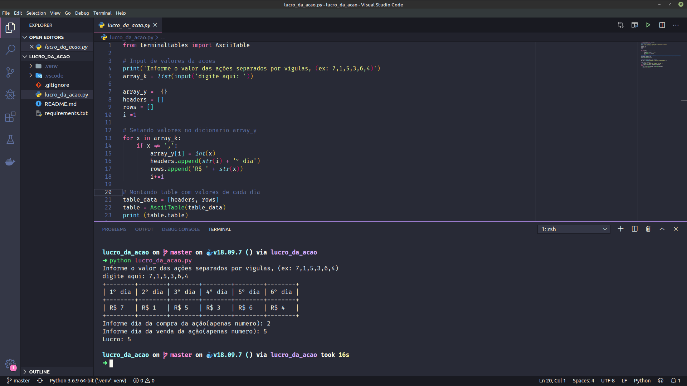

# Lucro da ação

Determine o maior lucro dado esse array K de preços.

### Pré-requisitos

Instale todas as dependências do requirements.txt com PIP

### Instalação

Crie um virtual env para empacotar suas libs Python

```
python3 -m venv .venv
```

Ative sua virtual env

```
source .venv/bin/activate
```


Use o PIP para instalar 'Terminaltables' para uma melhor visualização em forma da tabelas no terminal

```
pip install -r requirements.txt
```

Execute o programa

```
python lucro_da_acao.py
```

Resultado:
<p align="center">
    
</p>

## Authors

* **David Lucas** - *Site* - [david-luk4s](https://david-luk4s.github.io/)
